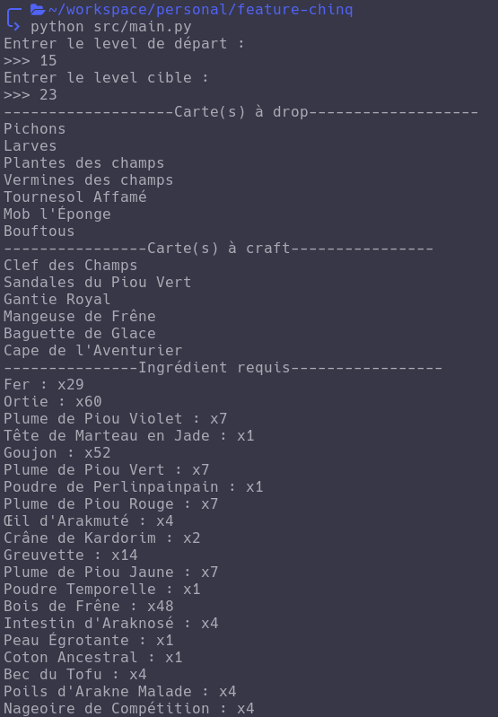

# 🎲 Calculateur Ressource tempros V 🎲

## 📖 description

Application permettant d'obtenir le nombre d'ingrédient requis pour passer un certains nombre de niveaux sur dofus sur les serveurs temporaire temporis. 

### Example d'utilisation

## ⚙️ Installation
prérequis : 
- python 3.x
- acces internet 
- lib requests

si requests n'est pas installer
> python3 -m pip install requests

1ère étape :
> git clone https://github.com/pilna/calculator-temporis.git

2nd étape :
> cd calculator-temporis

3ème étape :
> python3 src/main.py
